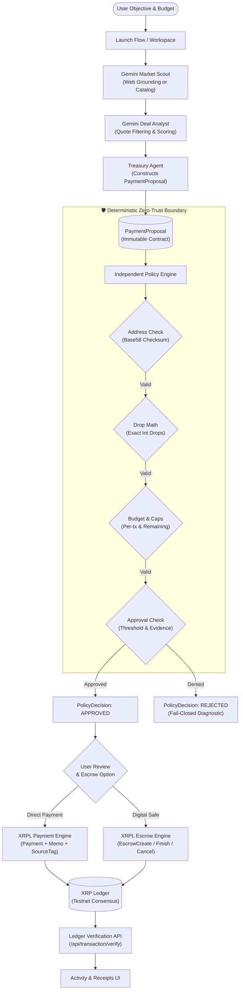

# Purchase LARP — Autonomous Agentic Procurement & XRPL Settlement Platform

An AI-native multi-agent procurement system that transforms natural-language user objectives into structured catalog discovery, rigorous multi-quote analysis, deterministic policy-governed approval, and cryptographic settlement on the XRP Ledger (XRPL) with native Escrows and on-chain audit trails.

Live Web-app: https://purchase-larp.vercel.app/

Built for **SingHacks 2026** — *Problem Statement: Ripple — AI-Native Business on XRPL*.

---

## Executive Summary & Problem Statement

Most AI assistant workflows stop at recommendation because models cannot safely execute or verify financial commitments. Connecting generative AI directly to private keys or payment endpoints introduces severe financial and operational hazards:

- **Model Hallucination & Drift**: LLMs can misinterpret amounts, invent vendor accounts, or hallucinate transaction confirmations.
- **Missing Authorization Boundaries**: Model reasoning must **never** be the sole authority deciding whether real capital moves.
- **Lack of Ledger-Grade Finality**: Autonomous commerce requires immutable transaction records, verifiable audit memos, and safety mechanisms (such as time-locked escrows) to prevent double-spending and unauthorized fund loss.

### The Solution: Decoupled Multi-Agent Architecture

Purchase LARP enforces a strict separation between **untrusted AI reasoning** and **trusted deterministic execution**:

1. **Discovery & Semantic Search**: Gemini Market Scout queries products either via live Web Search (with Google Search Grounding) or an internal testnet catalog.
2. **Deal Analysis**: Gemini Deal Analyst filters, scores, and ranks eligible quotes while deterministic code enforces hard budget bounds.
3. **Treasury Proposal**: Treasury converts the winning quote into an immutable, strongly-typed `PaymentProposal`.
4. **Zero-Trust Policy Engine**: An independent, deterministic rules engine verifies Classic XRPL addresses, drop-level precision, spending permissions, and cumulative budget limits.
5. **Human Approval Threshold & Digital Safe**: High-value transactions trigger human approval checks, and multi-stage deliveries can be locked into an XRPL time-based Digital Safe (Escrow).
6. **On-Chain Settlement**: The XRPL settlement engine signs transactions locally (private keys never leave the server), submits them to the XRP Ledger, attaches `SourceTag` and audit `Memos`, and confirms validated ledger inclusion.

---

## System Architecture



See [`docs/architecture.md`](docs/architecture.md) for the detailed sequence diagram and component specifications.

---

## Core Capabilities

### 1. Dual Discovery Modes & Multi-Currency Budgeting
- **Two-Field Intent Formulation**: The user specifies the target objective (e.g., `Ergonomic chair with lumbar support`) and pricing requirement (e.g., `between 4 and 5 XRP`, `max 100 SGD`, `between 20 and 50 EUR`).
- **Deterministic FX Bounds**: Currencies like SGD, EUR, USD, and BTC are parsed and converted to exact XRP limits using dated [currency-api](https://github.com/fawazahmed0/exchange-api) reference rates. Ambiguous currencies (e.g., unqualified `$`) fail closed with actionable user guidance.
- **Signed Conversion Previews**: The `/api/shopping/prepare` endpoint signs a 10-minute rate snapshot with HMAC tokens before executing search queries.
- **Web Search Mode**: Leverages Gemini with Google Search Grounding to discover live marketplace listings with source attribution, web citations, and extracted pricing.
- **Demo Catalog Mode**: Provides deterministic, reproducible mock merchant listings with genuine XRPL Testnet recipient addresses for instant end-to-end checkout.

### 2. Zero-Trust Deterministic Policy Engine (`src/lib/policy/`)
- **Fail-Closed by Design**: Any malformed payload, unknown field, negative/infinite amount, or missing context results in an immediate structured denial.
- **Exact Drop Arithmetic**: XRP amounts are converted to exact integer drops (`1 XRP = 1,000,000 drops`) to eliminate floating-point rounding errors and reject sub-drop precision.
- **Cryptographic Classic Address Validation**: Validates XRPL Classic addresses using Base58 decoding and double-SHA256 checksum verification without network roundtrips.
- **Multi-Tier Authorization**: Enforces single-transaction caps (`POLICY_TRANSACTION_LIMIT_XRP`), server-owned remaining budgets (`POLICY_REMAINING_BUDGET_XRP`), and human approval thresholds (`POLICY_APPROVAL_THRESHOLD_XRP`).

### 3. XRPL Digital Safe & Direct Settlement (`src/lib/xrpl/`)
- **Direct Payments**: Dispatches signed native XRP payments using XRPL `submitAndWait` for validated ledger finality.
- **Audit Trails**: Appends standard `SourceTag` (`20260530`) and hex-encoded JSON `Memos` to transactions, linking on-chain transactions directly to proposal IDs and agent decisions.
- **Digital Safe (Native Escrow)**:
  - Supports `EscrowCreate`, `EscrowFinish`, and `EscrowCancel`.
  - Enforces time locks with `FinishAfter` (earliest fulfillment) and `CancelAfter` (refund deadline).
  - Synchronizes with validated ledger consensus close times to ensure transactions execute reliably without timing race conditions.
- **Verification Engine**: Queries ledger index and transaction metadata via `/api/transaction/verify` to confirm finality and decode audit memos directly from ledger history.

### 4. Interactive Dashboard & Activity Center
- **Launchpad**: 3-step procurement flow: Intent & Budgeting &rarr; Multi-Agent Discovery &rarr; Policy Authorization & Settlement.
- **Marketplace & Agent Roster**: Inspect agent capability profiles (Market Scout, Deal Analyst, Treasury, XRPL Officer) and browse catalog inventory.
- **Activity & Receipt Explorer**: Tracks browser-persisted transaction receipts, on-chain transaction hashes, ledger indexes, and direct links to public XRPL explorers.

---

## Repository Structure

```text
.
├── src/
│   ├── app/                               # Next.js App Router (Pages & API routes)
│   │   ├── (auth)/login/                  # Shared demo login page
│   │   ├── activity/                      # Transaction history and receipt viewer
│   │   ├── agents/                        # Agent roster and individual capability profiles
│   │   ├── dashboard/                     # Procurement dashboard and agent status
│   │   ├── developers/                    # Developer documentation and integration guides
│   │   ├── launch/                        # 3-step procurement and launchpad UI
│   │   ├── marketplace/                   # Sample product and service catalog
│   │   └── api/                           # Secure server-side API endpoints
│   │       ├── agent/                     # Single-agent proposal adapter
│   │       ├── agents/orchestrate/        # Multi-agent procurement orchestrator
│   │       ├── auth/                      # Session management (login, session check, logout)
│   │       ├── catalog/deliver/           # Simulated merchant delivery service
│   │       ├── policy/                    # Policy evaluation endpoint
│   │       ├── shopping/                  # Shopping rate preparation & search execution
│   │       ├── transaction/               # Payment execution endpoint
│   │       │   ├── escrow/                # Native XRPL escrow operations (create/finish/cancel)
│   │       │   └── verify/                # Ledger verification and memo decoding
│   │       └── wallet/                    # Active agent wallet address & balance queries
│   ├── components/                        # Domain-organized UI components
│   ├── config/                            # Application constants and static configurations
│   ├── lib/                               # Core business logic and service implementations
│   │   ├── agent/                         # Proposal generation logic
│   │   ├── agents/                        # Scout, Analyst, Treasury, and Orchestrator agents
│   │   ├── auth/                          # HMAC session encryption and verification
│   │   ├── catalog/                       # Mock catalog repository
│   │   ├── gemini/                        # Google Gen AI client integration
│   │   ├── policy/                        # Deterministic rules engine and safety validators
│   │   ├── shopping/                      # Currency conversion rates, bounds, and search plans
│   │   └── xrpl/                          # Client connection, payments, escrows, and verification
│   └── types/                             # Jointly owned TypeScript type definitions
├── docs/                                  # Architectural specs, hosting guides, and integration docs
│   ├── architecture.md                    # System architecture and sequence workflows
│   └── hosting.md                         # Production hosting & Vercel deployment instructions
├── scripts/                               # Automation and verification smoke test scripts
│   ├── smoke-demo.mjs                     # End-to-end API & auth smoke test
│   └── smoke-shopping.mjs                 # Shopping search & currency rate smoke test
└── vitest.config.mts                      # Vitest test runner configuration
```

---

## API Reference

All non-auth API endpoints require a valid session cookie generated via `/api/auth/login`.

| Method | Endpoint | Description |
|---|---|---|
| `POST` | `/api/auth/login` | Authenticates shared demo credentials and sets an expiring HttpOnly session cookie. |
| `DELETE` | `/api/auth/session` | Terminates session and clears authentication cookies. |
| `GET` | `/api/wallet` | Returns the active agent's XRPL address, balance, and spendable reserves. |
| `POST` | `/api/shopping/prepare` | Parses budget/currency constraints, calculates FX rates, and signs a conversion preview token. |
| `POST` | `/api/shopping/search` | Executes Gemini Search Grounding (Web mode) or catalog matching (Demo mode). |
| `POST` | `/api/agents/orchestrate` | Runs the end-to-end multi-agent pipeline (Scout &rarr; Analyst &rarr; Treasury &rarr; Policy). |
| `POST` | `/api/policy` | Evaluates a `PaymentProposal` against deterministic safety, budget, and approval rules. |
| `POST` | `/api/transaction` | Re-authorizes proposal server-side, signs locally, and submits XRP payment to XRPL. |
| `POST` | `/api/transaction/escrow` | Manages XRPL Digital Safe lifecycle (`create`, `finish`, `cancel` escrows). |
| `GET` | `/api/transaction/verify` | Queries XRPL for validated transaction status, ledger index, and audit memos. |
| `POST` | `/api/catalog/deliver` | Triggers simulated merchant delivery updates for demonstration flows. |

---

## Getting Started

### Prerequisites
- **Node.js**: v20+ or v22 LTS recommended.
- **npm**: v10+

### 1. Installation
Clone the repository and install dependencies:

```bash
git clone https://github.com/itsjustmdawg/SingHacks2026_Ripple_Purchase_Larp.git
cd SingHacks2026_Ripple_Purchase_Larp
npm install
```

### 2. Environment Configuration
Copy `.env.example` to `.env.local`:

```bash
cp .env.example .env.local
```

Configure the environment variables in `.env.local`:

| Variable | Description | Default / Example |
|---|---|---|
| `GEMINI_API_KEY` | Google Gemini API key for Market Scout and Deal Analyst. | `AIzaSy...` |
| `GEMINI_MODEL` | Model ID for structured analysis and discovery. | `gemini-3.6-flash` |
| `XRPL_NETWORK` | Target XRPL network. | `testnet` |
| `XRPL_RPC_URL` | WebSocket RPC URL (leave empty for official testnet server). | `wss://s.altnet.rippletest.net:51233` |
| `XRPL_WALLET_SEED` | Testnet wallet secret seed (leave empty for auto-generated temporary wallet). | `sEd...` |
| `AUTH_SECRET` | 32+ character random string for signing session and rate tokens. | Generate via `openssl rand -hex 32` |
| `DEMO_LOGIN_EMAIL` | Shared demo login username. | `demo@purchaselarp.app` |
| `DEMO_LOGIN_PASSWORD`| Shared demo login password. | *Your secure password* |
| `POLICY_TRANSACTION_LIMIT_XRP` | Maximum XRP permitted for an individual proposal. | `10` |
| `POLICY_REMAINING_BUDGET_XRP` | Maximum cumulative budget allowed before policy rejects. | `25` |
| `POLICY_APPROVAL_THRESHOLD_XRP` | Amount requiring explicit dual-principal human approval. | `5` |

> [!IMPORTANT]
> Never commit `.env.local` or wallet seeds. In hosted environments (e.g. Vercel), configure a static funded Testnet wallet seed so separate serverless functions share the same identity and balance.

### 3. Running Locally
Start the Next.js development server:

```bash
npm run dev
```

Visit [http://localhost:3000](http://localhost:3000) and sign in using your configured credentials.

---

## Verification & Testing Suite

The repository features comprehensive automated and live test suites to guarantee safety and compliance.

### 1. Automated Test Suite (Vitest)
Executes 290 unit tests covering policy evaluation, address validation, drop precision, escrow operations, payments, and agent coordination:

```bash
npm test
```

### 2. Code Quality & Type Safety
Verifies TypeScript contracts and zero-warning ESLint standards:

```bash
npm run typecheck
npm run lint
```

### 3. Production Build Validation
Verifies Next.js compilation, tree-shaking, and static page generation:

```bash
npm run build
```

### 4. Read-Only Smoke Tests
Verifies authentication boundaries, protected endpoints, wallet availability, and search flows:

```bash
# Verify authentication, route protection, and agent orchestration
npm run smoke:demo

# Verify shopping constraints, currency conversions, and search plans
npm run smoke:shopping
```

---

## Production Readiness & Security Review

| Domain | Implemented Safeguards | Production Transition Path |
|---|---|---|
| **Private Keys** | Server-side local signing. Keys never leak to frontend, client browsers, or logs. | Migrate server seed to a Hardware Security Module (HSM) or Multi-Party Computation (MPC) custody solution. |
| **Policy Engine** | Deterministic fail-closed validation, exact drop conversions, classic address Base58 checksums, approval thresholds. | Back remaining budgets with an atomic database ledger instead of environment-level snapshots. |
| **Transaction Idempotency** | Browser-persisted pending flags block double-submissions upon reload. | Implement distributed server-side transaction journaling and submission queues. |
| **Escrow Safety** | Time-based escrows utilize verified ledger consensus close times (`close_time`). | Introduce decentralized delivery oracles or cryptographic fulfillment conditions for physical goods. |
| **Search Grounding** | Source-backed citations via Google Search Grounding; graceful fallback with explicit user labeling if quota is exhausted. | Enterprise Search Grounding quota with Redis caching for high-traffic commerce queries. |

See [`docs/hosting.md`](docs/hosting.md) for detailed Vercel production deployment procedures.

---

## Roadmap & Next Milestones

- [x] **Multi-Agent Discovery**: Gemini Market Scout and Deal Analyst with structured outputs.
- [x] **Zero-Trust Policy Guardrails**: Drop-level arithmetic, address validation, and human approval threshold checks.
- [x] **Direct XRPL Payments**: Validated payments with `SourceTag` and audit `Memos`.
- [x] **XRPL Digital Safe**: Native `EscrowCreate`, `EscrowFinish`, and `EscrowCancel` workflows.
- [x] **Multi-Currency Converter**: Support for SGD, EUR, USD, and BTC with daily FX rates.
- [ ] **RLUSD & Multi-Asset Support**: Trustline creation, DEX swapping, and RLUSD stablecoin settlement.
- [ ] **x402 Pay-Per-Call Protocol**: HTTP 402 micro-payment execution for machine-to-machine resource checkout.
- [ ] **Distributed Audit Ledger**: Persistent database-backed transaction journal with multi-tenant accounting.

---

## Team & Hackathon Ownership

| Workstream | Modules | Responsibility |
|---|---|---|
| **AI Agents & Discovery** | `src/lib/agents/`, `src/lib/agent/`, `src/lib/shopping/` | Search grounding, catalog analysis, and structured proposal authoring. |
| **Policy & Safety Engine** | `src/lib/policy/`, `src/app/api/policy/` | Zero-trust validation, address checksums, and authorization decisions. |
| **XRPL Settlement & Escrows** | `src/lib/xrpl/`, `src/app/api/transaction/` | Signing ceremonies, testnet payments, escrows, and ledger verification. |
| **Frontend & Integration** | `src/app/`, `src/components/`, `src/lib/auth/` | Launch flows, dashboard, activity center, and API security adapters. |

---

## License

This project is open-source under the [MIT License](LICENSE).
