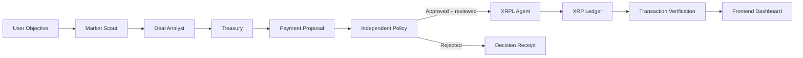

# Autonomous Agentic Payments System

A multi-agent procurement workflow that turns a user objective into catalog
research, a scored vendor selection, a structured payment proposal, an
independent policy decision, and verifiable XRP Ledger (XRPL) settlement.

## Problem

Most AI assistants can recommend financial actions but cannot securely execute
and verify them. Payment execution also needs a trustworthy authorization
boundary: model reasoning alone must never determine whether funds can move.

## Proposed solution

The system separates six concerns:

1. A Market Scout queries a mock service catalog.
2. A Deal Analyst filters the user budget and ranks eligible quotes.
3. A Treasury agent converts the selected quote into a typed payment proposal.
4. An independent policy engine approves or rejects that proposal.
5. The user reviews the exact recipient and amount before signing.
6. An XRPL agent settles approved requests and returns validated-ledger proof.

## Architecture



The specialist agents discover and propose, the policy engine authorizes, and
the XRPL layer executes. No layer takes on another layer's responsibility. See
[`docs/architecture.md`](docs/architecture.md) for the end-to-end sequence.

## Repository structure

```text
src/
├── app/                    # App Router pages and thin API adapters
│   ├── api/
│   │   ├── agent/
│   │   ├── agents/orchestrate/
│   │   ├── policy/
│   │   └── transaction/
│   └── dashboard/
├── components/             # UI components grouped by product domain
├── config/                 # Non-secret application configuration
├── lib/
│   ├── agent/              # Intent and proposal generation
│   ├── agents/             # Scout, analyst, treasury, and orchestration
│   ├── catalog/            # Mock service marketplace
│   ├── policy/             # Independent authorization rules
│   ├── utils/              # Small shared implementation utilities
│   └── xrpl/               # Transaction and verification boundary
└── types/                   # Shared contracts between all workstreams
```

## Team ownership

| Workstream | Primary ownership | Responsibility |
| --- | --- | --- |
| Person 1 — AI Agents | `src/lib/agent/`, `src/lib/agents/`, `src/lib/catalog/` | Scout, compare, and create structured proposals |
| Person 2 — Policy Engine | `src/lib/policy/` | Evaluate rules and return approval decisions |
| Person 3 — XRPL Transactions | `src/lib/xrpl/` | Build, submit, confirm, and verify transactions |
| Person 4 — Frontend + Integration | `src/app/`, `src/components/` | Build the dashboard and connect API boundaries |

Shared interfaces in `src/types/` are jointly owned contracts.

## Development setup

Requirements: a current Node.js LTS release and npm.

```bash
npm install
cp .env.example .env.local
npm run dev
```

Open [http://localhost:3000](http://localhost:3000). Additional checks:

```bash
npm run lint
npm run typecheck
npm test
npm run build
```

## Environment variables

Copy `.env.example` to `.env.local` and fill in only the values needed by your
workstream. Local `.env*` files are ignored by Git; `.env.example` is the only
exception.

| Variable | Purpose |
| --- | --- |
| `LLM_API_KEY` | Optional OpenAI API key for model-backed intent extraction |
| `LLM_MODEL` | OpenAI model ID; defaults to `gpt-5.6-luna` |
| `LLM_BASE_URL` | Optional OpenAI-compatible API base URL override |
| `XRPL_NETWORK` | XRPL network; use `testnet` during development |
| `XRPL_RPC_URL` | Optional XRPL WebSocket endpoint override |
| `XRPL_WALLET_SEED` | Optional local Testnet wallet seed |

Never commit wallet seeds, private keys, or API credentials. Do not use
production or mainnet credentials during early development.

## API boundaries

| Endpoint | Input | Current behavior |
| --- | --- | --- |
| `POST /api/agent` | `AgentRequest` | Returns a structured proposal using the configured model or deterministic fallback |
| `POST /api/agents/orchestrate` | `AgentRequest` | Runs scout, analyst, treasury, and policy stages and returns their decision receipts |
| `POST /api/policy` | `PaymentProposal` | Returns a `PolicyDecision` using temporary development rules |
| `POST /api/transaction` | `PaymentProposal` | Re-authorizes the proposal server-side, then submits approved XRP payments |

The API handlers are adapters only. Business logic belongs in `src/lib/`.

## Development principles

- Build the simplest working end-to-end transaction first.
- Use Testnet before mainnet.
- Never expose private keys.
- AI proposes actions; it does not bypass policy.
- Policy authorization stays separate from model reasoning.
- XRPL executes only approved requests.
- Do not over-engineer during the hackathon.
- Prefer working functionality over speculative features.

## MVP

1. A user enters a procurement objective and optional XRP budget.
2. The scout returns matching catalog offers.
3. The analyst filters and ranks quotes.
4. Treasury creates a structured proposal for the selected vendor.
5. Policy evaluates it independently and the user reviews the exact payment.
6. An approved transaction is submitted to XRPL Testnet.
7. The UI displays each handoff, confirmation, ledger index, and hash.

## Stretch goals

The following are explicitly outside the MVP:

- x402 support
- Machine-to-machine payments
- Human approval thresholds
- Transaction history
- Configurable budgets
- Additional assets
- An advanced policy engine

## Collaboration

This is a four-person hackathon repository designed for frequent contributions
with AI coding assistants. Respect folder ownership and communicate before
changing another person's module. Avoid repo-wide refactors during active
development. Coordinate changes to `src/types/`, because shared contracts can
affect every workstream. Prefer small, focused commits that are easy to review.
