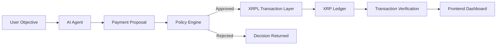

# Autonomous Agentic Payments System

An AI-assisted payment workflow that turns a user objective into a structured
proposal, evaluates it through an independent policy engine, settles approved
payments on the XRP Ledger (XRPL), and presents verifiable on-chain proof.

> Agent intent extraction and policy evaluation are implemented. Wallet
> management, XRPL submission, and ledger verification are intentionally not
> implemented yet.

## Problem

Most AI assistants can recommend financial actions but cannot securely execute
and verify them. Payment execution also needs a trustworthy authorization
boundary: model reasoning alone must never determine whether funds can move.

## Proposed solution

The system separates four concerns:

1. An AI agent interprets a user's objective and proposes a payment action.
2. An independent policy engine approves or rejects the structured proposal.
3. An XRPL service executes approved requests and verifies ledger confirmation.
4. A frontend dashboard shows the complete decision and transaction trail.

## Architecture



The agent proposes, the policy engine authorizes, and the XRPL layer executes.
No layer should take on another layer's responsibility. See
[`docs/architecture.md`](docs/architecture.md) for the end-to-end sequence.

## Repository structure

```text
src/
├── app/                    # App Router pages and thin API adapters
│   ├── api/
│   │   ├── agent/
│   │   ├── policy/
│   │   └── transaction/
│   └── dashboard/
├── components/             # UI components grouped by product domain
├── config/                 # Non-secret application configuration
├── lib/
│   ├── agent/              # Intent and proposal generation
│   ├── policy/             # Independent authorization rules
│   ├── utils/              # Small shared implementation utilities
│   └── xrpl/               # Transaction and verification boundary
└── types/                   # Shared contracts between all workstreams
```

## Team ownership

| Workstream | Primary ownership | Responsibility |
| --- | --- | --- |
| Person 1 — AI Agent | `src/lib/agent/` | Interpret objectives and create structured proposals |
| Person 2 — Policy Engine | `src/lib/policy/` | Evaluate rules and return approval decisions |
| Person 3 — XRPL Transactions | `src/lib/xrpl/` | Build, submit, confirm, and verify transactions |
| Person 4 — Frontend + Integration | `src/app/`, `src/components/` | Build the dashboard and connect API boundaries |

Shared interfaces in `src/types/` are jointly owned contracts.

## Development setup

Requirements: a current Node.js LTS release and npm.

```bash
npm install
cp .env.example .env.local
npm run dev
```

Open [http://localhost:3000](http://localhost:3000). Additional checks:

```bash
npm run lint
npm run typecheck
npm test
npm run build
```

## Environment variables

Copy `.env.example` to `.env.local` and fill in only the values needed by your
workstream. Local `.env*` files are ignored by Git; `.env.example` is the only
exception.

| Variable | Purpose |
| --- | --- |
| `LLM_API_KEY` | Optional OpenAI API key for model-backed intent extraction |
| `LLM_MODEL` | OpenAI model ID; defaults to `gpt-5.6-luna` |
| `LLM_BASE_URL` | Optional OpenAI-compatible API base URL override |
| `XRPL_NETWORK` | XRPL network; use `testnet` during development |
| `XRPL_RPC_URL` | Future XRPL JSON-RPC/WebSocket endpoint |
| `XRPL_WALLET_SEED` | Future local Testnet wallet seed |

Never commit wallet seeds, private keys, or API credentials. Do not use
production or mainnet credentials during early development.

## API boundaries

| Endpoint | Input | Current behavior |
| --- | --- | --- |
| `POST /api/agent` | `AgentRequest` | Returns a structured proposal using the configured model or deterministic fallback |
| `POST /api/policy` | `PaymentProposal` | Returns a `PolicyDecision` using temporary development rules |
| `POST /api/transaction` | `TransactionRequest` | Delegates to the XRPL module and returns `501`; no transaction is submitted |

The API handlers are adapters only. Business logic belongs in `src/lib/`.

## Development principles

- Build the simplest working end-to-end transaction first.
- Use Testnet before mainnet.
- Never expose private keys.
- AI proposes actions; it does not bypass policy.
- Policy authorization stays separate from model reasoning.
- XRPL executes only approved requests.
- Do not over-engineer during the hackathon.
- Prefer working functionality over speculative features.

## MVP

1. A user enters an objective.
2. The agent creates a structured payment proposal.
3. The policy engine evaluates it.
4. An approved transaction is submitted to XRPL Testnet.
5. Transaction confirmation and a hash are returned.
6. The UI displays the full flow.

## Stretch goals

The following are explicitly outside the MVP:

- x402 support
- Machine-to-machine payments
- Multiple cooperating agents
- Human approval thresholds
- Transaction history
- Configurable budgets
- Additional assets
- An advanced policy engine

## Collaboration

This is a four-person hackathon repository designed for frequent contributions
with AI coding assistants. Respect folder ownership and communicate before
changing another person's module. Avoid repo-wide refactors during active
development. Coordinate changes to `src/types/`, because shared contracts can
affect every workstream. Prefer small, focused commits that are easy to review.
